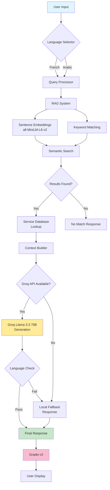
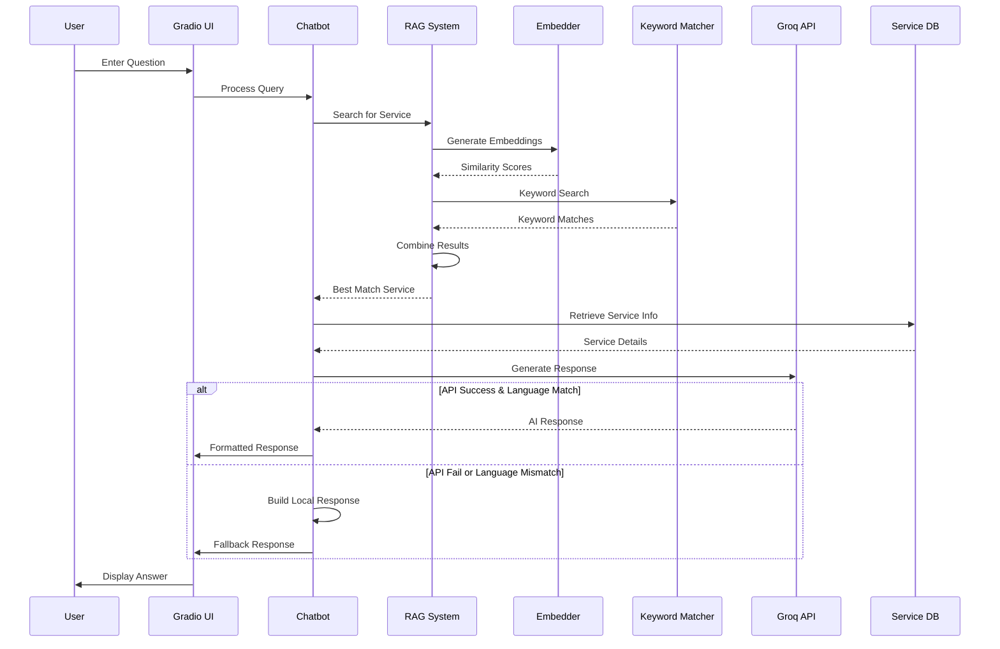
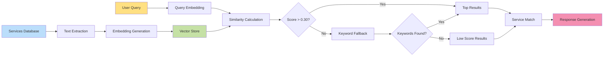
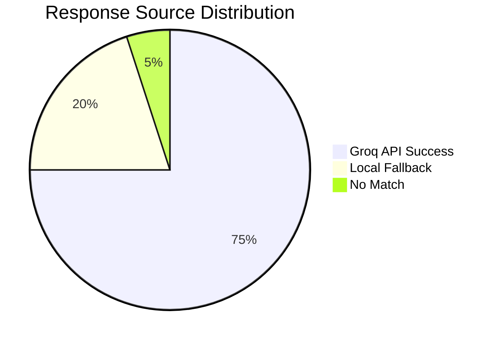

# 🇲🇷 Mauritania Government Services Chatbot

[](https://www.python.org/downloads/)
[](https://groq.com/)
[](https://gradio.app/)
[](https://opensource.org/licenses/MIT)

An intelligent bilingual chatbot (Arabic/French) powered by Groq's Llama 3.3 70B model to help Mauritanian citizens navigate government services and administrative procedures.

---

## 📋 Table of Contents

- [Features](#-features)
- [Architecture](#-architecture)
- [System Flow](#-system-flow)
- [Installation](#-installation)
- [Usage](#-usage)
- [Services Covered](#-services-covered)
- [Technical Stack](#-technical-stack)
- [API Configuration](#-api-configuration)
- [Project Structure](#-project-structure)
- [Contributing](#-contributing)
- [License](#-license)

---

## ✨ Features

- 🌍 **Bilingual Support**: Full support for Arabic (العربية) and French (Français)
- 🤖 **AI-Powered Responses**: Uses Groq's Llama 3.3 70B for intelligent, context-aware answers
- 📚 **RAG System**: Retrieval-Augmented Generation with semantic search and keyword matching
- 🎯 **Service-Specific Information**: Detailed guides for 5+ government services
- ⚡ **Fast Response Times**: Optimized with Groq's lightning-fast inference
- 🔄 **Robust Fallback System**: Guaranteed responses even if API fails
- 💬 **User-Friendly Interface**: Clean Gradio UI with quick action buttons
- 🔍 **Smart Search**: Combines embeddings and keyword matching for accurate results

---

## 🏗 Architecture



---

## 🔄 System Flow



---

## 📊 Data Flow



---

## 🚀 Installation

### Prerequisites

- Python 3.8 or higher
- Groq API key ([Get one here](https://console.groq.com/))

### Step 1: Clone the Repository

```bash
git clone https://github.com/yourusername/mauritania-chatbot.git
cd mauritania-chatbot
```

### Step 2: Create Virtual Environment

```bash
python -m venv venv
source venv/bin/activate  # On Windows: venv\Scripts\activate
```

### Step 3: Install Dependencies

```bash
pip install gradio sentence-transformers numpy groq
```

Or use requirements.txt:

```bash
pip install -r requirements.txt
```

### Step 4: Configure API Key

Open the Python file and replace the API key:

```python
GROQ_API_KEY = "your_api_key_here"
```

Or use environment variable:

```bash
export GROQ_API_KEY="your_api_key_here"
```

### Step 5: Run the Application

```bash
python app.py
```

The application will launch at `http://localhost:7860`

---

## 💻 Usage

### Basic Usage

1. **Select Language**: Choose French (🇫🇷) or Arabic (🇲🇷)
2. **Ask Question**: Type your question in the message box
3. **Get Answer**: Receive detailed, context-aware response
4. **Quick Actions**: Use preset buttons for common questions

### Example Queries

**French:**
- "Comment obtenir une carte d'identité?"
- "Quels documents pour le passeport?"
- "Comment payer ma facture SOMELEC?"

**Arabic:**
- "كيف أحصل على بطاقة تعريف؟"
- "ما هي وثائق جواز السفر؟"
- "كيف أدفع فاتورة الكهرباء؟"

---

## 🏛 Services Covered

| Service | Arabic | French | Category |
|---------|--------|--------|----------|
| National ID Card | بطاقة التعريف الوطنية | Carte d'identité nationale | Documents |
| Passport | جواز السفر | Passeport | Documents |
| Electricity Bills | فاتورة الكهرباء | Facture électricité | Bills |
| Hospital Appointment | موعد في المستشفى | Rendez-vous hôpital | Health |
| Driver's License | رخصة القيادة | Permis de conduire | Transport |

### Service Information Includes:

- 📋 Required documents
- 📝 Step-by-step procedures
- 💰 Costs and fees
- ⏱ Processing duration
- 🏢 Relevant government offices
- 💳 Payment methods

---

## 🛠 Technical Stack

### Core Technologies

| Component | Technology | Purpose |
|-----------|-----------|---------|
| **LLM** | Groq Llama 3.3 70B | Natural language generation |
| **Embeddings** | sentence-transformers/all-MiniLM-L6-v2 | Semantic search |
| **UI Framework** | Gradio | User interface |
| **Vector Operations** | NumPy | Similarity calculations |
| **API Client** | Groq Python SDK | LLM integration |

### Model Specifications

- **Model**: `llama-3.3-70b-versatile`
- **Temperature**: 0.7
- **Max Tokens**: 500
- **Top P**: 0.9

---

## 🔧 API Configuration

### Groq API Setup

1. Sign up at [Groq Console](https://console.groq.com/)
2. Create a new API key
3. Add to your environment:

```python
GROQ_API_KEY = "gsk_..."
```

### API Features Used

- ✅ Chat completions
- ✅ System prompts
- ✅ Temperature control
- ✅ Token limiting

---

## 📁 Project Structure

```
mauritania-chatbot/
│
├── app.py                  # Main application file
├── requirements.txt        # Python dependencies
├── README.md              # This file
│
├── config/
│   └── services_db.py     # Service database (optional split)
│
└── utils/
    ├── rag_system.py      # RAG implementation (optional split)
    └── groq_client.py     # Groq API wrapper (optional split)
```

---

## 🎯 Key Components

### 1. RAG System

```python
class RAGSystem:
    - Embedding-based semantic search
    - Keyword matching fallback
    - Multi-strategy result ranking
```

### 2. Groq Client

```python
class GroqChatbot:
    - Robust response parsing
    - Language verification
    - Error handling & fallbacks
```

### 3. Services Database

```python
SERVICES_DB = {
    "service_id": {
        "name_ar": "...",
        "name_fr": "...",
        "documents_required": [...],
        "steps": [...],
        "cost": "...",
        ...
    }
}
```

---

## 🔍 How It Works

### Search Strategy

1. **Semantic Search**: Generate query embedding → Calculate cosine similarity
2. **Threshold Check**: If score ≥ 0.30 → Use top results
3. **Keyword Fallback**: If low score → Try keyword matching
4. **Minimum Results**: Return best matches even if score < 0.30

### Response Generation

1. **Context Building**: Compile service information
2. **API Call**: Send to Groq with language-specific prompt
3. **Language Check**: Verify response matches requested language
4. **Fallback**: Use local response if API fails or language mismatch

---

## 🤝 Contributing

Contributions are welcome! Here's how:

1. Fork the repository
2. Create a feature branch (`git checkout -b feature/AmazingFeature`)
3. Commit your changes (`git commit -m 'Add AmazingFeature'`)
4. Push to the branch (`git push origin feature/AmazingFeature`)
5. Open a Pull Request

### Areas for Contribution

- 🌍 Add more services
- 🔍 Improve search accuracy
- 🎨 Enhance UI/UX
- 📝 Update documentation
- 🐛 Fix bugs
- ✨ Add new features

---

## 📈 Performance



### Typical Response Times

- **API Response**: 0.5-2.0 seconds
- **Local Fallback**: < 0.1 seconds
- **Embedding Search**: < 0.05 seconds

---

## 🐛 Troubleshooting

### Common Issues

**1. API Key Error**
```
Solution: Check GROQ_API_KEY in code or environment
```

**2. Import Errors**
```bash
pip install --upgrade gradio sentence-transformers groq
```

**3. Language Mismatch**
```
Solution: Automatic fallback to local response
```

**4. No Results Found**
```
Solution: Try rephrasing query or use different keywords
```

---


---

## 🙏 Acknowledgments

- Groq for providing fast LLM inference
- Sentence Transformers for embedding models
- Gradio for the UI framework
- The Mauritanian community for service information

---


---

<div align="center">

**Made with ❤️ for Mauritania**

⭐ Star this repo if you find it helpful!

</div>
